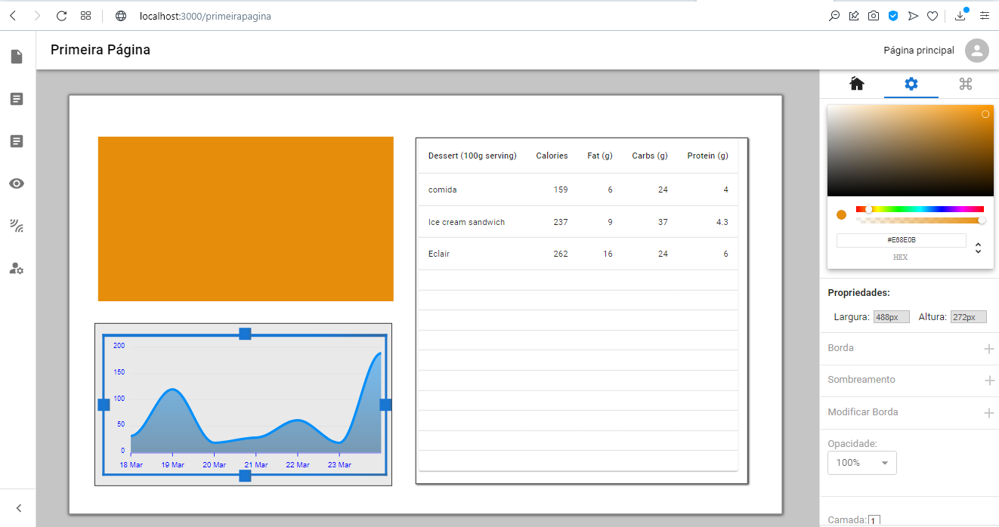
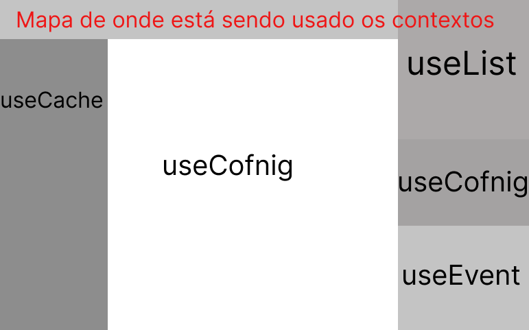

## ❗AVISO
Após o deploy houve conflitos com uso de certos frameworks na vercel que para algumas pessoas
pode gerar bugs de estilização, para ter a versão mais "pura" e ou fique com dúvidas de como
foram feitas algumas funcionalidades do sistema caso tu seja dev, baixe o repositório em sua 
máquina ou veja a documentação abaixo ☟

### Projeto CMS 
Após terminar o modulo de react que fiz no meu curso, resolvi planejar e botar em prática
uma grande aplicação, um sistema para poder manipular objetos e formar interações ( como 
se fosse um tcc). Não consigo nem descrever o tamanho do aprendizado que eu tive fazendo esse
projeto, escalabilidade de código, solução de problemas, mais conhecimento de uso técnico
até de assuntos que nem havia estudado no curso. Graças ao criador do céu e da terra pude
em fim concluir esse que pra mim foi um grande desafio ao longo desses 2 meses de projeto.



## 💡Técnologias
- ReactJS
- NextJs
- TypeScript
- VanillaJS
- Material UI
- Sass
- Styled Components
- React Flow
- Lógica E-C-A

## 🚀 Começando

Rodar o servidor
```bash
npm run dev
# ou
yarn dev
```
Abra em [http://localhost:3000](http://localhost:3000) 

## 📚 [Documentação]

Algumas tipagemns foram adaptadas para poder utilizar com outras bibliotecas e evitar
conflitos com typescript, por isso mistura de português com inglês.



## useList

>list:
>id - Identificador | Serve para identificação e relacionamento entre Topicos <-> Config <-> Eventos.<br />
>name - Auto Explicativo.<br />
>tipoCache - Elemento para ter controle da lista entre as páginas.<br />
>evt - Carrega toda a querydos eventos. Imagine uma linha de comando desestruturada em objeto<br />
>children - Array que guarda os elementos filhos.<br />

## useConfig
>configuracoes: 
>id - Identificador | Serve para identificação e relacionamento entre Topicos <-> Config <-> Eventos.<br />
>type - Tipo do Elemento | Serve na hora da criação para que na frente possa ser renderizado na tela.<br />
>tipoCache - Elemento para ter controle da lista entre as páginas.<br />
>idGrupo - Identificador para descobrir se o elemente participa de algum grupo no momento de remover.<br />
>config - Carrega as configurações.<br />

## useEvent
>queryEvento:
>idBotao - Auto Explicativo.<br />
>evento: Tipo de evento, o sistema foi criado apenas para ter o click, mas pode ser adicioando também focus, hover e etc.<br />
>nomeAlvo - Gurda o nome do elemento que será modificado para que apareça na função de tooltips no canto inferior esqurdo<br />
>condicao: {<br />
> par1 - Mantem uma condição em string, EX: "ELEMENTO1 WIDTH === "ELEMENTO2 WIDTH2" <br />
> par2 - Possui as condições, maior, menor, maior que, menor que, diferente, igual etc.<br />
> par3 - Mantem uma condição em string, EX: "ELEMENTO1 WIDTH === "ELEMENTO2 WIDTH2" <br />
}<br />
acao: {<br />
>id: Identificador do Alvo a ser alterado<br />
>tipo: Qual parametro vai ser alterado, width, height, bgColor, etc<br />;
>alterado: Valor para alterar;<br />
},<br />
>ativado - Idenfificador para que não ative qualquer botão que seja criado.<br />

## useCache
>configPagina:
>identificador -  Auto Explicativo.<br />
>nomePagina -  Auto Explicativo.<br />
>iconeId -  Auto Explicativo.<br />

## Ler mais na documentação do next js
- [Next.js Documentation](https://nextjs.org/docs) - learn about Next.js features and API.
- [Learn Next.js](https://nextjs.org/learn) - an interactive Next.js tutorial.
